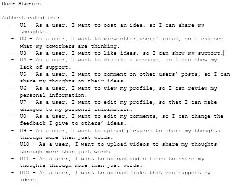
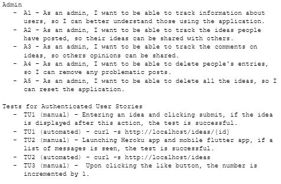
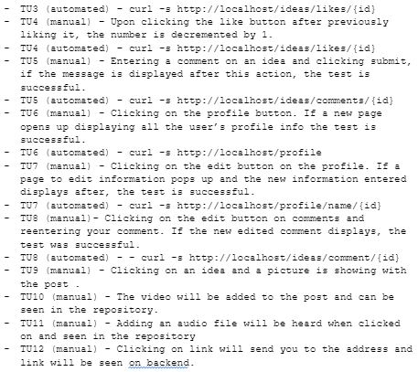
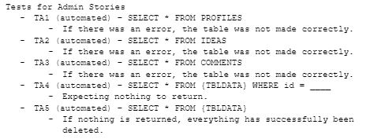
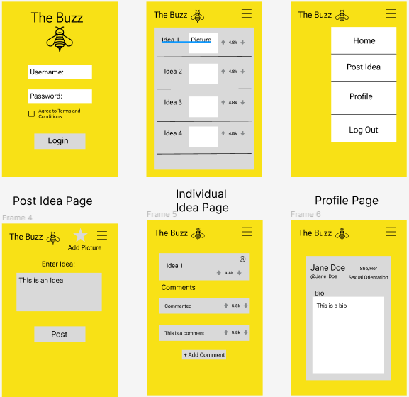
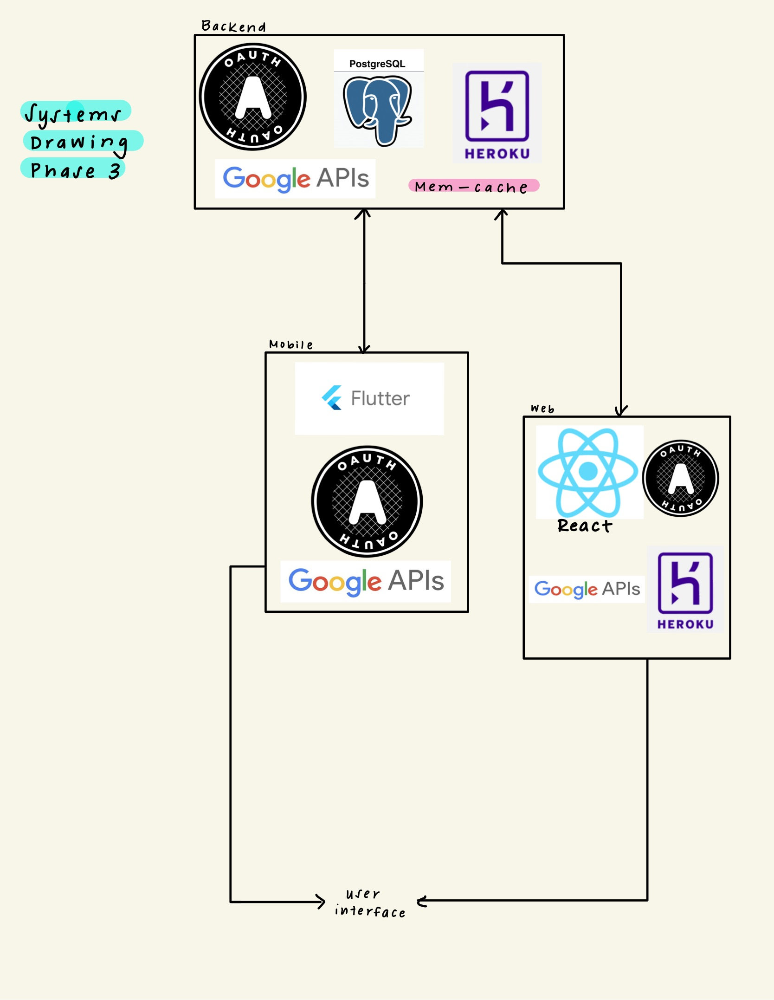
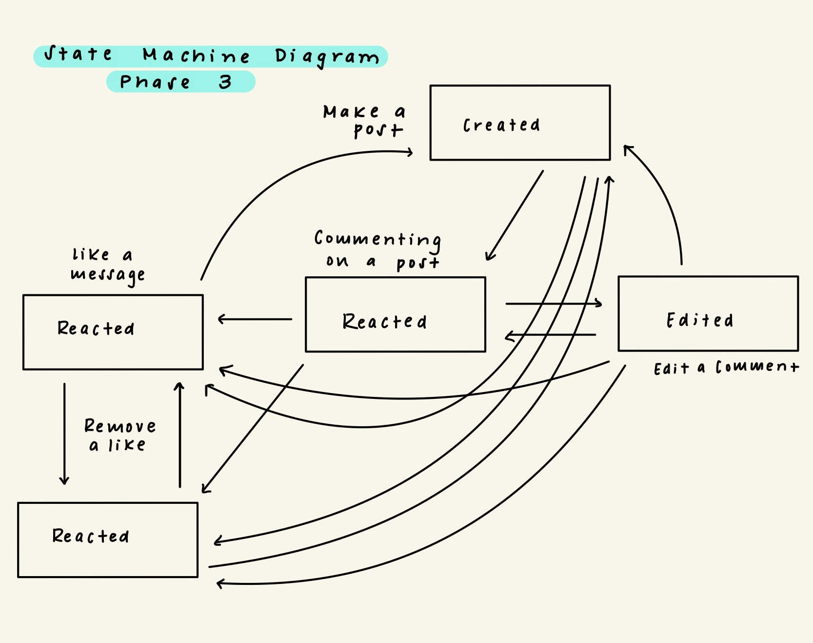
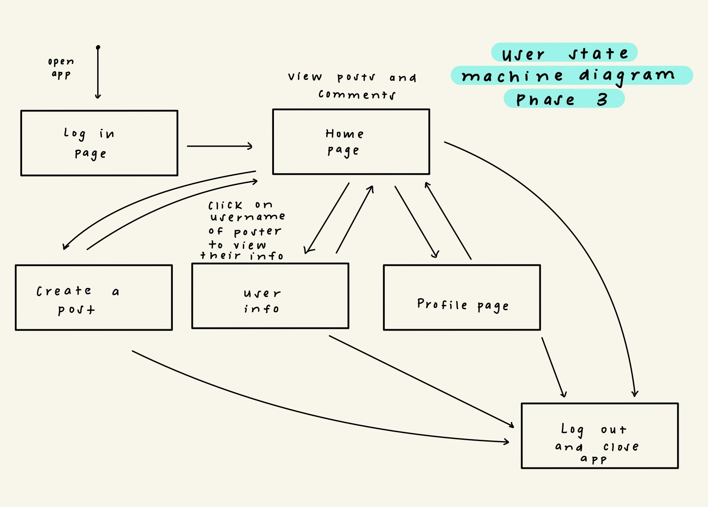
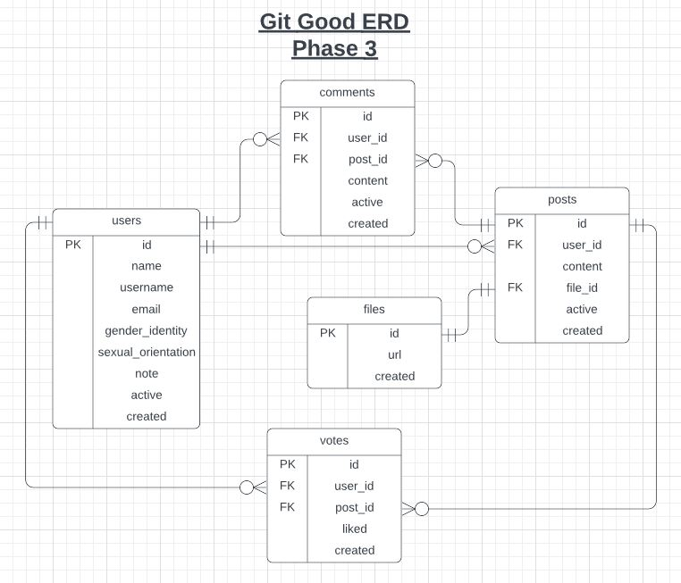

# README - Team Git Good

# The Buzz

# Sprint 10 - Phase 3

# Alex Beggs - arb223@lehigh.edu

# Christian Oneal - ceo223@lehigh.edu

# Isabella Hudson - iah224@lehigh.edu

# Khushi Patel - kmp425@lehigh.edu

# Nick Healy - nah224@lehigh.edu

## Bitbucket Repo

https://bitbucket.org/coneal223/cse216_gitgood/src/master/

## Trello Board

https://trello.com/b/VKwwrzt8/git-good-project

# Documentation

[Backend Documentation](./Artifacts/docs/backend_docs/DatabaseHTML/index.html)
[Admin Documentation](./Artifacts/docs/admin_docs/index.html)
[Web Documentation](./Artifacts/docs/web_docs/index.html)
[Mobile Documentation](./Artifacts/docs/mobile_docs/main-library.html)

# Design Details

## User & Admin Stories and Tests

## Mock mobile user interface:

## Mock web user interface:

[Web Mock Up](https://www.figma.com/file/uWlDaZZoku4DBFV0JE8XHq/TheBuzzWebDesign?node-id=14%3A27)

## System Drawing

## State Machine Drawing Idea Object Perspective

## State Machine Drawing User Perspective

## API Route Listing

- GET /posts  
  Returns JSON: {\<post_id>: {"text": "abc", "votes": 123, "comments": {\<comment_id>: {"text": "abc"}, ...}}, ...}  
  To get information about all posts, includes text, vote count, and list of comments

- GET /posts/{post_id}  
  Returns JSON: {"id": 123, "text": "abc", "votes": 123, "comments": {\<comment_id>: {"text": "abc"}, ...}}  
  To get information about a specific post, includes text, vote count, and list of comments

- POST /posts  
  Accepts JSON: {"text": "abc"}  
  To create a new post

- POST /posts/{post_id}/votes  
  Accepts JSON: {"liked": true}  
  To upvote or downvote a message, a boolean is passed to indicate which direction the vote was made

- POST /posts/{post_id}/comments  
  Accepts JSON: {"text": "abc"}  
  To create a new comment on a post

- PATCH /posts/{post_id}/comments/{comment_id}  
  Accepts JSON: {"text": "abc"}  
  To edit a comment on a post

- GET /users  
  Returns JSON: {\<user_id>: {"name": "abc", "username": "abc", "email": "a@b.c", "gender_identity": "abc", "sexual_orientation": "abc", "note": "abc"}, ...}  
  To get information about all users, including name, username, email, gender identity, sexual_orientation, and a note

- GET /users/{id}  
  Returns JSON: {"id": 123, "name": "abc", "username": "abc", "email": "a@b.c", "gender_identity": "abc", "sexual_orientation": "abc", "note": "abc"}  
  To get information about a specific user, including name, username, email, gender identity, sexual_orientation, and a note

- PATCH /users/{id}
  Accepts JSON: {"name": "abc", "username": "abc", "email": "a@b.c", "gender_identity": "abc", "sexual_orientation": "abc", "note": "abc"}
  To update a specific users profile information

- POST /auth/login  
  Accepts JSON: {"email": "a@b.c", "token": "abc"}  
  To login using OAuth2v
- POST /files/{file_id}/{url}
  Accepts JSON: {"files": "filename.txt","url"}
  To post a file to a non user google drive account

- GET files/{file_id}
  Returns JSON: {"Displaying files": "filename.txt"}
  Receive a given file and stores it to a non user google account drive

## ERD of Database

## Description of Tests

Backend

- curl /posts

- To retrieve all posts to see if everything is being stored correctly.

- curl /posts/{id}

- To retrieve a specific post information

- curl /posts

- To create a new post and check return status code

- curl /posts/{id}/votes

- To retrieve the vote count of a post, to see if storing the vote counts is working correctly.

- curl /posts/{id}/comments

- To create a new comment on a post and check return status code

- curl /posts/{id}/comments/{id}

- To update an existing comment on a post and check return status code

- curl /posts/login

- To login as a user with OAuth

- curl /users

- To retrieve all users information

- curl /users/{id}

- To retrieve a specific users information

- curl /posts/{file_id}/{url}

- To upload a file

- curl /posts/{file_id}

- To receive, display and store a file in a non user google account drive

Admin

- Testing that database tables can be created

- Testing that database tables can be dropped or deleted

- Testing that database entries can be deleted

- Testing that posts, users, and comments can be set to active or disabled

Web

- Click like button - expect like count to increment, if clicked again expect like count to decrement

- Click button for adding a new idea - expect idea creation form to be unhidden, idea list to be hidden

- Submit a new idea - expect idea creation form to be hidden, idea list to be unhidden

- Comment on an idea, expect to see under the idea when clicked

- Be able to navigate through pages (home page, add idea page, profile page)

- Editing profile changes and seeing changes once submitted

- Can add link or files to posts and comments

Mobile

- Click like button - expect like count to increment, if clicked again expect like count to decrement

- Click button for adding a new idea - expect idea creation form to be unhidden, idea list to be hidden

- Submit a new idea - expect idea creation form to be hidden, idea list to be unhidden

- Comment on an idea, expect to see under the idea when clicked

- Be able to navigate through pages (home page, add idea page, profile page)

- Editing profile changes and seeing changes once submitted

- Files can be uploaded and seen on posts

## Description

Our application allows users to post ideas for other users to view. Users are able to sign in using Google OAuth2 and view their profile information on a profile page. They can view a list of all posts on the application, like and dislike posts, and leave and edit comments on each post.
